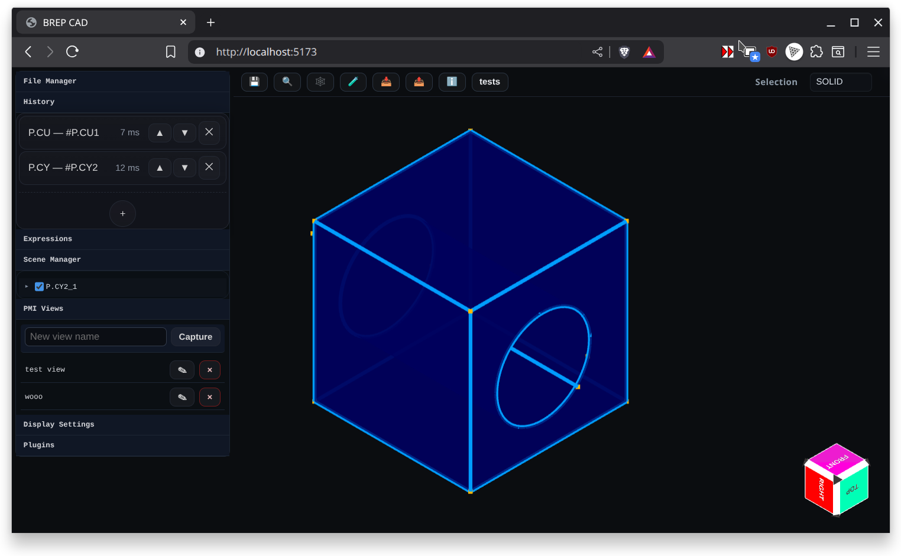
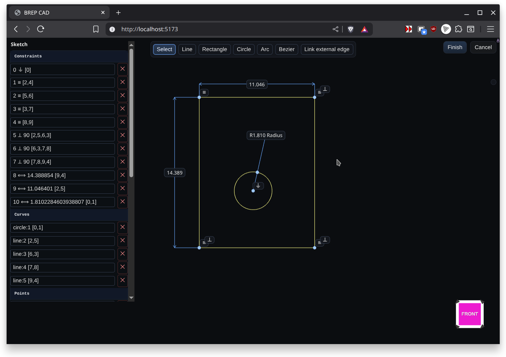
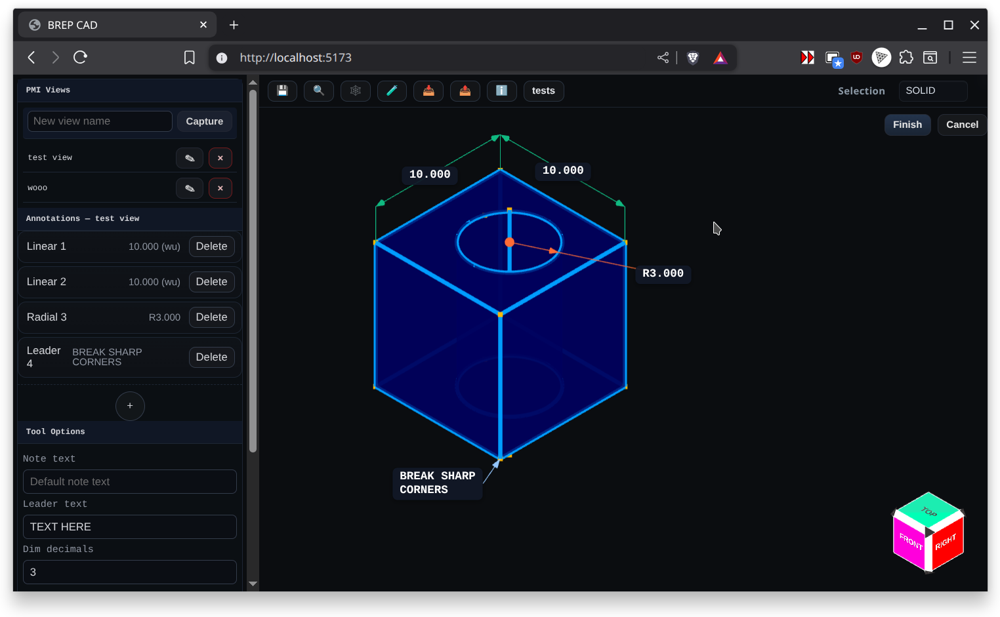
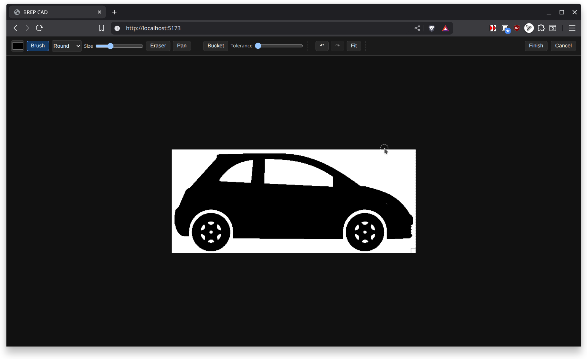
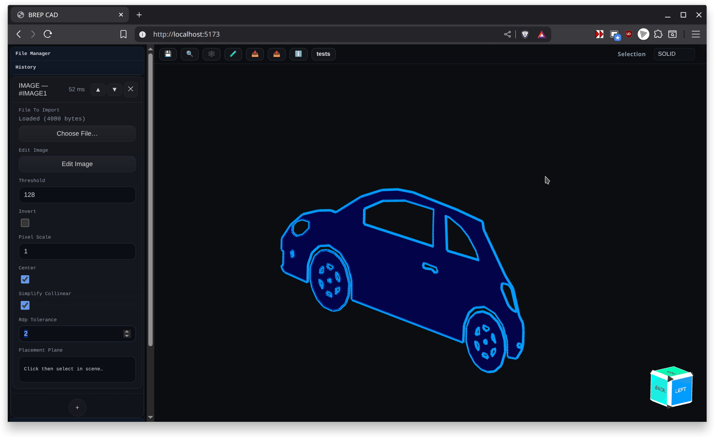

# [BREP](https://github.com/mmiscool/BREP)
## [Source repo https://github.com/mmiscool/BREP](https://github.com/mmiscool/BREP)

A feature-based modeling playground experimenting with BREP-style workflows on top of triangle meshes. It combines robust manifold CSG (via the [Manifold](https://github.com/elalish/manifold/) library) with a simple face and edge representation, a history pipeline, and Three.js visualization. Import meshes (STL), repair and group them into faces, then perform boolean operations, fillets, chamfers, sweeps, lofts, and more.

This project is actively evolving; expect rough edges while APIs settle.

## Documentation Map

- [Highlights](docs/highlights.md)
- [What's New](docs/whats-new.md)
- [Getting Started](docs/getting-started.md)
- [UI Overview (Browser)](docs/ui-overview.md)
- [How It Works](docs/how-it-works.md)
- [History Systems](docs/history-systems.md)
- [BREP Model and Classes](docs/brep-model.md)
- [File Formats: Import and Export](docs/file-formats.md)
- [Plugins and Examples](docs/plugins.md)
- [Recent Inspector Improvements](docs/inspector-improvements.md)
- [Inspector Todo](docs/todo.md)

## Using as an npm package

- Install:
  - `pnpm add brep-io-kernel`
- Import options:
  - `import { BREP, PartHistory } from 'brep-io-kernel';`
  - `import { BREP } from 'brep-io-kernel/BREP';`
  - `import { PartHistory } from 'brep-io-kernel/PartHistory';`
  - `import { AssemblyConstraintHistory, AssemblyConstraintRegistry } from 'brep-io-kernel';`

## Feature Dialog Screenshots

- Run `pnpm dev` and open `http://localhost:5173/feature-dialog-capture.html`.
- Use the capture helper to grab updated PNGs for every feature dialog or download them as a ZIP for docs.

## Mode Guides

- [Modeling Mode](docs/modes/modeling.md)
- [Sketch Mode](docs/modes/sketch.md)
- [PMI Mode](docs/modes/pmi.md)
- [Assembly Constraint Solver](docs/assembly-constraints/solver.md)

## Feature Guides

- [Primitive Cube](docs/features/primitive-cube.md) — Implemented
- [Primitive Cylinder](docs/features/primitive-cylinder.md) — Implemented
- [Primitive Cone](docs/features/primitive-cone.md) — Implemented
- [Primitive Sphere](docs/features/primitive-sphere.md) — Implemented
- [Primitive Torus](docs/features/primitive-torus.md) — Implemented
- [Primitive Pyramid](docs/features/primitive-pyramid.md) — Implemented
- [Plane](docs/features/plane.md) — Implemented
- [Datum](docs/features/datum.md) — Implemented
- [Sketch](docs/features/sketch.md) — Implemented
- [Extrude](docs/features/extrude.md) — Implemented
- [Sweep](docs/features/sweep.md) — Implemented
- [Tube](docs/features/tube.md) — Implemented
- [Loft](docs/features/loft.md) — Implemented
- [Revolve](docs/features/revolve.md) — Implemented
- [Mirror](docs/features/mirror.md) — Implemented
- [Boolean](docs/features/boolean.md) — Implemented
- [Fillet](docs/features/fillet.md) — Implemented
- [Chamfer](docs/features/chamfer.md) — Implemented
- [Remesh](docs/features/remesh.md) — Implemented
- [Import 3D Model (STL or 3MF)](docs/features/import-3d-model.md) — Implemented
- [Image to Face (image trace)](docs/features/image-to-face.md) — Implemented
- [Transform (move, rotate, scale)](docs/features/transform.md) — Implemented
- [Pattern Linear](docs/features/pattern-linear.md) — Implemented
- [Pattern Radial](docs/features/pattern-radial.md) — Implemented

## License

See [LICENSE.md](LICENSE.md). This project uses a dual-licensing strategy managed by Autodrop3d LLC.

## Contributing

See [CONTRIBUTING.md](CONTRIBUTING.md) for guidelines on submitting pull requests, reporting issues, and participating in discussions.
