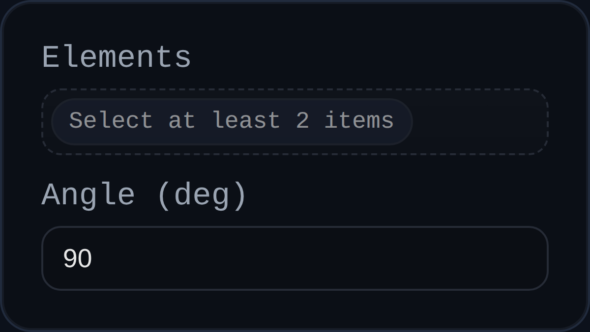

# Angle Constraint

Status: Implemented

Angle constraints rotate components until the measured angle between two references matches a specified target. They work on face normals or edge directions and are ideal for setting hinge offsets or maintaining draft angles during assembly.

## Inputs
- `id` – solver-assigned identifier (for example `ANGL3`).
- `elements` – two selections. Faces use their resolved normals; edges use the edge direction extracted from geometry.
- `angle` – desired signed angle in degrees. The implementation normalises the value to the `[-360, 360]` range before solving.

## Behaviour
- Resolves each selection to a component, origin, and direction vector. Faces defer to `resolveParallelSelection()`, while edges derive a direction from geometry or PMI utilities.
- Rejects selections that cannot provide a direction, that belong to the same component, or that are not both attached to assembly components.
- Measures the current signed angle, keeps both radian and degree readings in `persistentData`, and compares the angular error against either the supplied `context.angleTolerance` or a tolerance derived from the solver's positional tolerance.
- Decides how to distribute the correction: if both components can move it splits the delta angle evenly; otherwise the entire adjustment is applied to the movable component.
- Uses `computeRotationTowards()` plus the solver `rotationGain` to cap the per-iteration rotation step (bounded by `MAX_ROTATION_PER_ITERATION` from the parallel alignment utilities).
- Records every applied quaternion in `lastAppliedRotations` for downstream diagnostics.

## Usage Tips
- Pair Angle with Coincident or Distance when you need to control both the pivot point and the orientation.
- Use a smaller `rotationGain` for stiff systems or when starting far from the target angle; it helps prevent oscillation.
- If the constraint refuses to solve, confirm both selections resolve to different components and that each exposes a valid direction vector.
