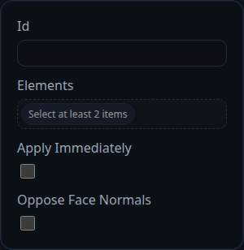

# Coincident Constraint

Status: Implemented

The coincident constraint brings two references to the same world-space location by translating their owning components. It is the general-purpose mate used for points, edges, faces, or whole components.

## Inputs
- `constraintID` – unique identifier generated by the history; used for UI labels and debugging.
- `elements` – exactly two selections (vertex, edge, face, or component). The solver resolves each selection to a world-space point before measuring the gap.
- `applyImmediately` – legacy flag populated by the UI; the iterative solver ignores it.
- `faceNormalOpposed` – reserved for future expansion and currently unused.

## Behaviour
- Rebuilds the world-space representative point for each selection using `objectRepresentativePoint()` (with a fallback to `BaseAssemblyConstraint.getWorldPoint()`).
- Rejects selections that belong to the same component or that cannot be resolved to assembly components, surfacing `status: 'invalid-selection'`.
- Measures the vector between the two points, compares its length to the solver tolerance, and records the current error in `persistentData`.
- Splits the correction vector between both components when neither one is fixed; otherwise moves only the movable component. If both components are fixed the constraint reports `status: 'blocked'`.
- Applies translations through `context.applyTranslation()` so the solver can sync back to feature data and accumulate `lastAppliedMoves`.

## Usage Tips
- Pair a Coincident constraint with a Parallel or Angle constraint when you need both contact and orientation control.
- Lower the solver `translationGain` when working with very small tolerances to avoid overshooting on dense assemblies.
- Use the solver's debug hooks to watch `lastAppliedMoves` if a component fails to move; it usually indicates the part is already fixed or belongs to the same component as the other selection.
