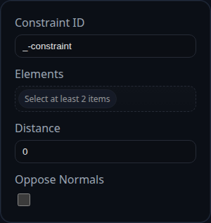

# Distance Constraint

Status: Implemented

Distance constraints maintain a target separation between two references. They support point/point, point/edge, point/face, edge/edge, and face/face combinations and will translate components until the measured offset matches the requested distance.

## Inputs
- `id` – unique label used across the solver UI and logs.
- `elements` – two references (faces, edges, or vertices). Component references are treated as points at their representative location.
- `distance` – desired separation in scene units. Negative input is clamped to zero.
- `opposeNormals` – for face-to-face alignment, flips the normal on the second selection before the parallel alignment stage.

## Behaviour
- If both selections are faces, the solver first delegates to `solveParallelAlignment()` to make the faces parallel. It pauses the distance stage while orientation adjustments are pending.
- Measures the current separation with specialised routines for different selection pairings (for example perpendicular distance for edges or signed offset along the face normal).
- Records the absolute error in `persistentData.error` and honours the solver tolerance to decide when the constraint is satisfied.
- When movement is required, splits the correction between components unless one of them reports `isComponentFixed(component) === true`.
- Applies all translations through `context.applyTranslation()` and keeps a log of moves in `lastAppliedMoves` (useful for UI tooltips or debugging).
- In debug mode the constraint emits temporary arrow helpers that show the resolved surface normals being used during the orientation stage.

## Usage Tips
- Combine Distance with Parallel when you need to hold two planar faces at a controlled offset.
- Toggle `opposeNormals` if the alignment stage happens with both faces pointing the same way when you expected an opposed configuration.
- Large jumps are easier to converge when you reduce the solver `translationGain`; increase it back toward 1.0 for the final tightening iterations.
