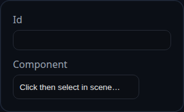

# Fixed Constraint

Status: Implemented

Fixed constraints lock an assembly component in place so other constraints treat it as immovable. They usually provide the reference frame that every other constraint solves against.

## Inputs
- `constraintID` – solver-assigned identifier that appears in the constraint list.
- `component` – single component selection. No other entity types are accepted.

## Behaviour
- Resolves the selection to an assembly component and verifies that it exposes the `isAssemblyComponent` marker used throughout the solver.
- Marks the component and its owning feature as fixed (`component.fixed = true` and `feature.inputParams.isFixed = true`) so downstream calls to `isComponentFixed()` short-circuit.
- Stores a friendly component name in `persistentData.componentName` for UI presentation.
- Reports whether the component was already fixed so the UI can skip redundant status updates.

## Usage Tips
- Always fix at least one component in an assembly; otherwise every constraint will read as `blocked` because both sides appear movable.
- Use Fixed constraints for temporary jig components: remove the constraint after the rest of the assembly is solved to free the part again.
- When importing legacy data, run the solver once—Fixed constraints will refresh feature metadata that older saves might not have populated.
