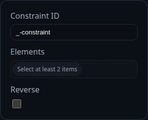

# Touch Align Constraint

Status: Experimental

Touch Align constraints drive two like-kind references into contact while also aligning their orientations. They extend the parallel alignment logic with a translation phase so the selected entities share the same location in space.

## Inputs
- `id` – solver-generated identifier (for example `TALN5`).
- `elements` – two selections of the same kind (face/face, edge/edge, or point/point). Mixed types are rejected.
- `reverse` – flips the stored orientation preference, mirroring the behaviour of the Parallel constraint.

## Behaviour
- **Face to face**: runs `solveParallelAlignment()` to align the surface normals, then translates components along the normal direction until the sampled origins coincide within tolerance.
- **Edge to edge**: orients the edges into parallel directions, measures the shortest vector between their supporting lines, and translates components to eliminate the separation.
- **Point to point**: alternates between small rotations (about a resolved component midpoint) and translations, using `rotationGain` and `translationGain` to gracefully converge even when the points start far apart.
- Records applied moves and rotations in `persistentData.lastAppliedMoves` / `lastAppliedRotations`, along with the most recent error value so the UI can communicate progress.
- Relies on `isComponentFixed()` to determine how to split corrections; if both components are fixed the constraint reports `status: 'blocked'`.

## Limitations
- Mixed-type selections (for example face-to-edge) are currently unsupported and will return `status: 'unsupported-selection'`.
- Point-to-point mode derives rotation pivots from component bounds; unusually shaped components may require several iterations before the points line up.
- Debug helpers (normal arrows) are only emitted for face and edge modes when the solver runs with `debugMode` enabled.

## Usage Tips
- Use Touch Align instead of pairing Coincident with Parallel when you want a single constraint to enforce both contact and orientation.
- If a face-to-face alignment lands on the wrong side, toggle `reverse` to swap which normals oppose each other before the translation phase starts.
- Keep an eye on `persistentData.pointToPointNextMode` when debugging point contacts; it reveals whether the next iteration plans a rotation or translation step.
