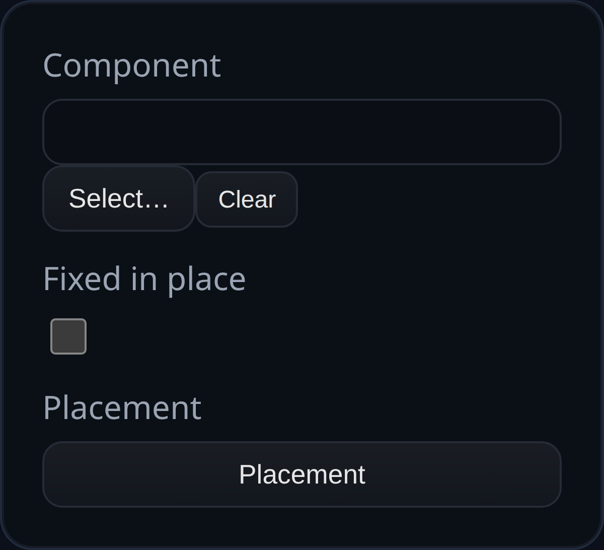

# Assembly Component

Status: Implemented

Assembly Component inserts a saved 3MF component into the current assembly, optionally fixing it in place and positioning it with a transform gizmo.

## Inputs
- `componentName` – Pick a saved component from the library (3MF payload with optional embedded feature history).
- `isFixed` – Lock the component so assembly constraints treat it as immobile.
- `transform` – Placement transform (position/rotation/scale) applied to the inserted component bodies.

## Behaviour
- Loads the selected 3MF, rebuilds solids from meshes (or from embedded feature history when present), and groups them under a single assembly component node.
- Applies the feature ID prefix to body/face names for stable selections, then visualizes the inserted bodies.
- Persists the component payload in `persistentData` so reruns do not depend on local storage or library lookups.
