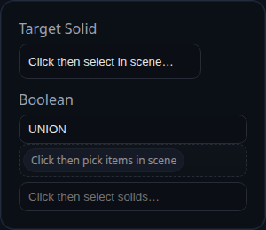

# Boolean

Status: Implemented

Boolean combines existing solids by running Manifold CSG through `BREP.applyBooleanOperation`. The feature keeps face labels intact so downstream selections survive.

## Inputs
- `targetSolid` – the solid that supplies the base body for UNION/INTERSECT operations.
- `boolean.targets` – additional solids to use as tools. Duplicate entries are ignored.
- `boolean.operation` – `UNION`, `SUBTRACT`, or `INTERSECT`. `NONE` leaves the scene unchanged.
 - `boolean.simplify` – optional. If `true`, simplifies the boolean result using a tolerance (see below). If a number, it is treated as the tolerance directly. If omitted, a global default may apply.
 - `boolean.simplifyTolerance` – optional numeric tolerance to use when simplifying. Takes precedence when provided.

## Behaviour
- UNION and INTERSECT treat the target as the base body and remove the original target from the scene once the new solid is created.
- SUBTRACT unions all tool solids first, then removes that volume from the target so complex multi-tool cuts stay watertight.
- Each tool and the original target solid is flagged for removal after the operation; only the new solids returned by the kernel remain in the timeline.

When simplification is enabled, the output solid(s) are passed through `Solid.simplify(tol)`. By default, a small global tolerance is used if configured internally; you can override per-feature via `boolean.simplify`/`boolean.simplifyTolerance`.
