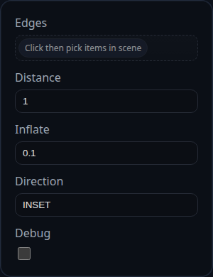

# Chamfer

Status: Implemented

Chamfer builds a bevel on the selected edges of a single solid by cutting (INSET) or unioning (OUTSET) helper solids generated by `BREP.ChamferSolid`.

## Inputs
- `edges` – select edges directly or pick faces to gather all of their boundary edges.
- `distance` – the single offset distance used for both faces meeting at each edge.
- `inflate` – optional expansion of the helper body to avoid sliver leftovers (small values like `0.0005` are typical).
- `direction` – `INSET` subtracts material, `OUTSET` adds material. `AUTO` is reserved for internal use.
- `debug` – keeps the intermediate helper solids visible for inspection.

## Behaviour
- All selected edges must belong to the same solid. When multiple faces are selected the feature expands them into unique edges.
- The target solid is cloned, each helper body is booleaned in sequence, and the original solid is flagged for removal when the chamfer succeeds.
- When `debug` is enabled, helper solids are left in the scene; otherwise only the finished solid is returned.
