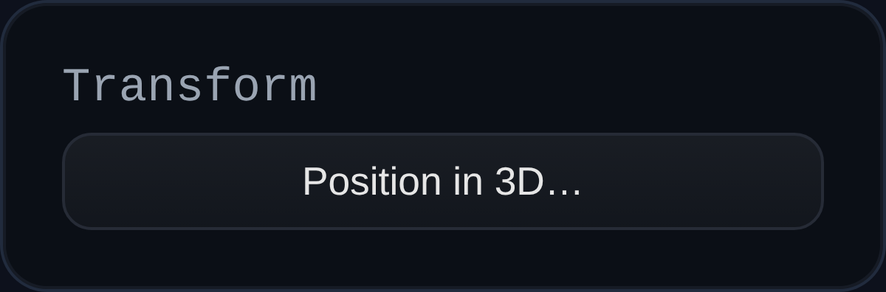

# Datium

Status: Implemented

Datium creates an orthogonal datum triad (XY/XZ/YZ planes) for sketching and feature references.

## Inputs
- `transform` – Position, rotation, and scale applied to the datum group.

## Behaviour
- Emits a `THREE.Group` named after the feature ID containing three selectable planes tagged as `PLANE`.
- Planes are oriented like the Plane feature and respond to the supplied transform, making it easy to anchor sketches or construction geometry away from the origin.
