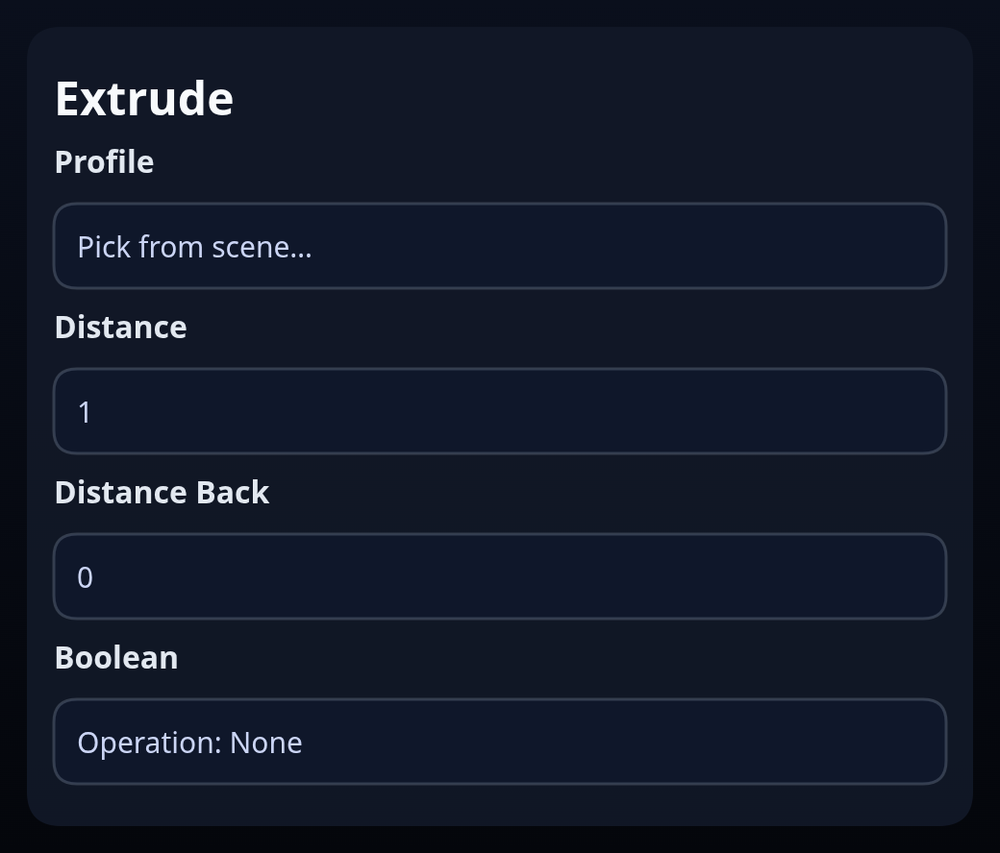

# Extrude

Status: Implemented

Extrude offsets a single face or sketch profile along its normal using the `BREP.Sweep` translator. Draft or directional flips are not yet exposed.

## Inputs
- `profile` – a face or sketch containing a face. When a sketch is selected it is removed from the scene after the solid is created.
- `distance` – forward distance along the face normal.
- `distanceBack` – optional distance in the opposite direction for two-sided extrudes.
- `boolean.operation` / `boolean.targets` – optional union, subtract, or intersect with existing solids.

## Behaviour
- The profile is swept in translate mode; the feature automatically nudges subtract/union distances to avoid coplanar artifacts.
- Circular edges in the profile emit centerlines for downstream constraints.
- When `boolean.operation` is `NONE` the new solid is returned directly. Otherwise the helper applies the requested CSG operation and removes the source sketch/solids that were consumed.
