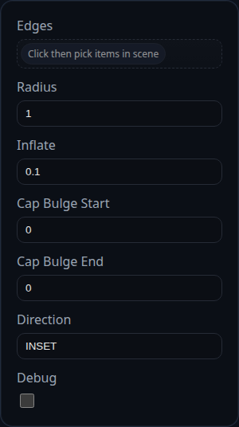

# Fillet

Status: Implemented

Fillet replaces selected edges on a single solid with a constant-radius blend generated by `BREP.filletSolid`.

## Inputs
- `edges` – pick edges directly or select faces to expand into their boundary edges.
- `radius` – constant radius used for every edge.
- `inflate` – expands subtracting tools to avoid coplanar leftovers; ignored for closed loops.
- `capBulgeStart` / `capBulgeEnd` – optional amount to puff the end caps when cutting material.
- `direction` – `INSET` cuts material, `OUTSET` unions material back.
- `debug` – keeps helper bodies visible and logs extra diagnostics.

## Behaviour
- All selected edges must belong to the same solid. The feature remeshes that solid before cutting so the section frames are stable, then remaps the selection to the new topology.
- Chamfer helpers are booleanned sequentially; when direction is `INSET` the feature nudges coplanar caps to keep the final face set clean.
- After blending, the original solid is removed and the simplified result is returned. Enabling `debug` leaves the helper bodies in the scene for inspection.
