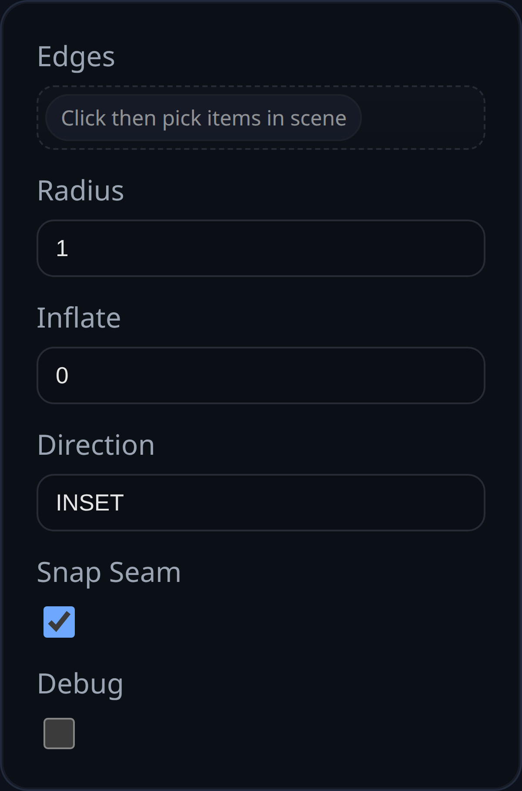

# Fillet

Status: Implemented

Fillet replaces selected edges on a single solid with a constant-radius blend generated by `BREP.filletSolid`.

## Inputs
- `edges` – pick edges directly or select faces to expand into their boundary edges.
- `radius` – constant radius applied to every edge.
- `resolution` – number of segments around the fillet tube; increase for smoother large radii.
- `inflate` – offsets tangency curves and end caps to avoid coplanar leftovers; closed loops skip the wedge inset to avoid self‑intersection.
- `direction` – `INSET` cuts material, `OUTSET` unions material back.
- `combineEdges` – OUTSET-only; hulls fillet ends that share a vertex so corner seams stay closed.
- `showTangentOverlays` – adds pre-inflate tangency polylines to the helper tube for debugging.
- `debug` – keeps helper bodies visible and logs extra diagnostics.

## Behaviour
- All selected edges must belong to the same solid; face picks expand to boundary edges before the builder runs.
- Helper tube/wedge bodies are generated per edge and booleaned in sequence (union for OUTSET, subtract for INSET). When `combineEdges` is enabled, shared OUTSET corners are hulled together before the boolean to close gaps.
- Closed-loop paths suppress the wedge inset used for INSET cuts so the cutter does not self-intersect; tangency offsets still keep the fillet slightly inflated to avoid coplanar seams.
- On success the original solid is replaced by the blended result. Enabling `debug` leaves the helper tube/wedge (and any corner hulls or tangent overlays) in the scene for inspection.
