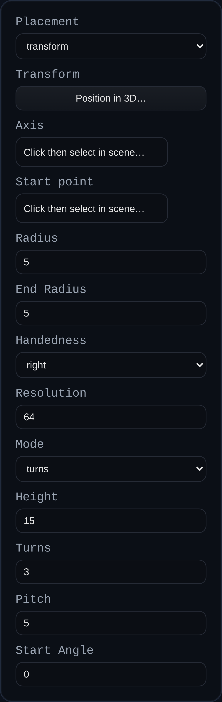

# Helix

Status: Implemented

Helix creates a parametric helical curve you can reuse as a path for sweeps, tubes, or future thread features. Geometry generation is delegated to the BREP kernel (`buildHelixPolyline`) so the same code can drive downstream operations.

## Inputs
- `radius` – Base radius of the helix.
- `endRadius` – Optional end radius for tapering.
- `pitch` – Distance advanced per turn along the axis.
- `lengthMode` – Choose whether `turns` or `height` drives total length.
- `turns` – Number of turns (used in `turns` mode).
- `height` – Total height along the axis (used in `height` mode).
- `startAngle` – Starting angle in degrees.
- `handedness` – Choose right- or left-handed winding.
- `resolution` – Segments per turn for the preview polyline.
- `placementMode` – Use `transform` or align to an `axis` + `startPoint`.
- `axis` – Edge selection for the helix axis (when using axis placement).
- `startPoint` – Optional start point when using axis placement.
- `transform` – Position, rotation, and scale (when using transform placement).

## Behaviour
- Computes helix points in the kernel for consistent reuse (threads, path-driven features).
- Builds an EDGE with world-space `polylineLocal` data plus helper axis and endpoints.
- Stores the generated helix data in `persistentData.helix` for later edits or inspection.
