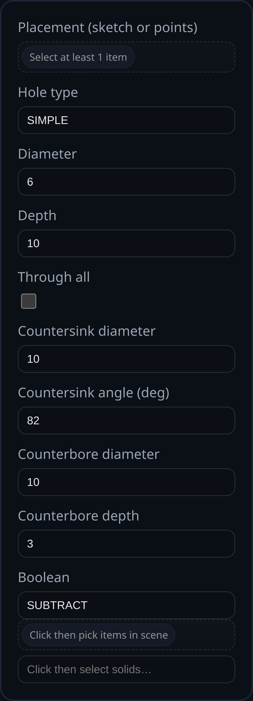

# Hole

Status: Implemented

Adds drilled-style holes with optional countersink or counterbore. The feature accepts a sketch or one or more vertices as placement inputs and produces separate holes for every point selected (sketch center P0 is ignored by default).

## Inputs
- **Placement (sketch or points)** – Pick a sketch (all sketch points except the auto center) or select individual vertices. Each point creates its own hole.
- **Hole type** – `SIMPLE`, `COUNTERSINK`, or `COUNTERBORE`.
- **Diameter** – Core hole diameter.
- **Depth** – Total hole depth (straight portion). For countersink/counterbore, the sink/bore occupies part of this total; the straight leg shortens accordingly.
- **Through all** – If enabled, cuts through the entire target; depth is ignored.
- **Countersink diameter / angle** – For countersinks.
- **Counterbore diameter / depth** – For counterbores.
- **Boolean** – Optional boolean operation (defaults to subtracting from the target solid).

## Notes
- When a sketch is selected, the feature automatically gathers its sketch points (except P0) and places one hole per point.
- Countersink/counterbore depth is part of the total depth: e.g., total depth 4 with counterbore depth 1 yields a 1‑unit bore plus a 3‑unit straight leg.
- Hole metadata (center, normal, dimensions, and source selection) is stored for PMI hole callouts.
