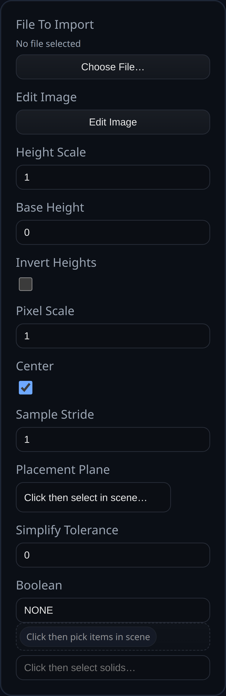

# Image Heightmap Solid

Status: Implemented

Image Heightmap Solid samples a grayscale (or RGB) image and extrudes the pixels into a heightfield solid, with optional simplification and booleans.

## Inputs
- `fileToImport` – PNG heightmap data (file, data URL, or buffer). If empty, the image editor starts with a blank canvas.
- `editImage` – Opens the built-in paint-style editor to tweak the heightmap.
- `heightScale` – World units of elevation for a full-intensity pixel (0–255).
- `baseHeight` – Baseline Z height added to every pixel.
- `invertHeights` – Flip grayscale so dark pixels become tall regions.
- `pixelScale` – World units per pixel in X/Y.
- `center` – Center the heightmap about the origin before placement.
- `sampleStride` – Sample every Nth pixel to reduce triangle count.
- `placementPlane` – Optional face or plane that defines the placement plane and normal.
- `simplifyTolerance` – Tolerance for Manifold simplify (0 disables).
- `boolean.operation` / `boolean.targets` – Optional boolean with existing solids.

## Behaviour
- Decodes the image to a grid, samples with the requested stride, and builds top/bottom meshes offset by `baseHeight` plus scaled pixel heights (with optional invert).
- Positions the mesh on the selected plane (or world XY) and centers it if requested.
- Applies optional simplification, runs the configured boolean, and returns the new solid while flagging consumed inputs for removal.
