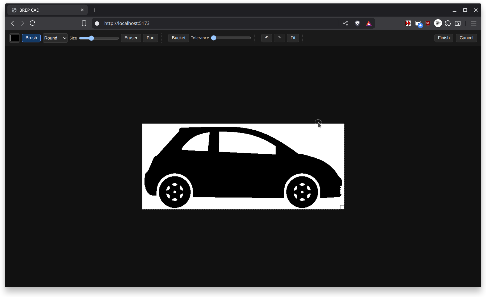

# Image to Face

Status: Implemented

Image to Face traces a source image into planar geometry that can be placed on any sketch plane or selected face. It is ideal for logos, decorative cutouts, and relief features.

## Parameters
- **threshold** (0-255) controls how dark a pixel must be to form geometry.
- **invert** flips dark and light interpretation for the trace.
- **pixelScale** and **center** adjust the size and placement of the resulting sketch.
- **simplify options** reduce jagged edges on the traced outline.
- **placementPlane** lets you place the traced sketch onto a selected face or datum plane; otherwise the world origin is used.
- **Edit Image** opens the integrated editor.

The feature emits a `SKETCH` group that contains a triangulated face and edge polylines. Downstream features (Extrude, Revolve, Sweep) can consume the face directly.

## Inline Image Editor
- Starts with your current image or a default 300x300 white canvas.
- Dark themed UI renders at 1:1 pixels with device pixel ratio awareness for crisp previews.
- Tools include Brush, Eraser, Pan (Space), and Paint Bucket with a tolerance slider (0-255).
- Brush tool offers live cursor outline, multiple shapes (round, square, diamond), and an eraser that respects the selected shape.
- Bottom-right resize handle lets you expand or crop the canvas while preserving existing strokes.
- Undo and Redo history, Fit view, Finish (saves back to the feature), and Cancel are available during editing.

Use Finish to update the feature image and rerun the timeline, or Cancel to discard any edits.
