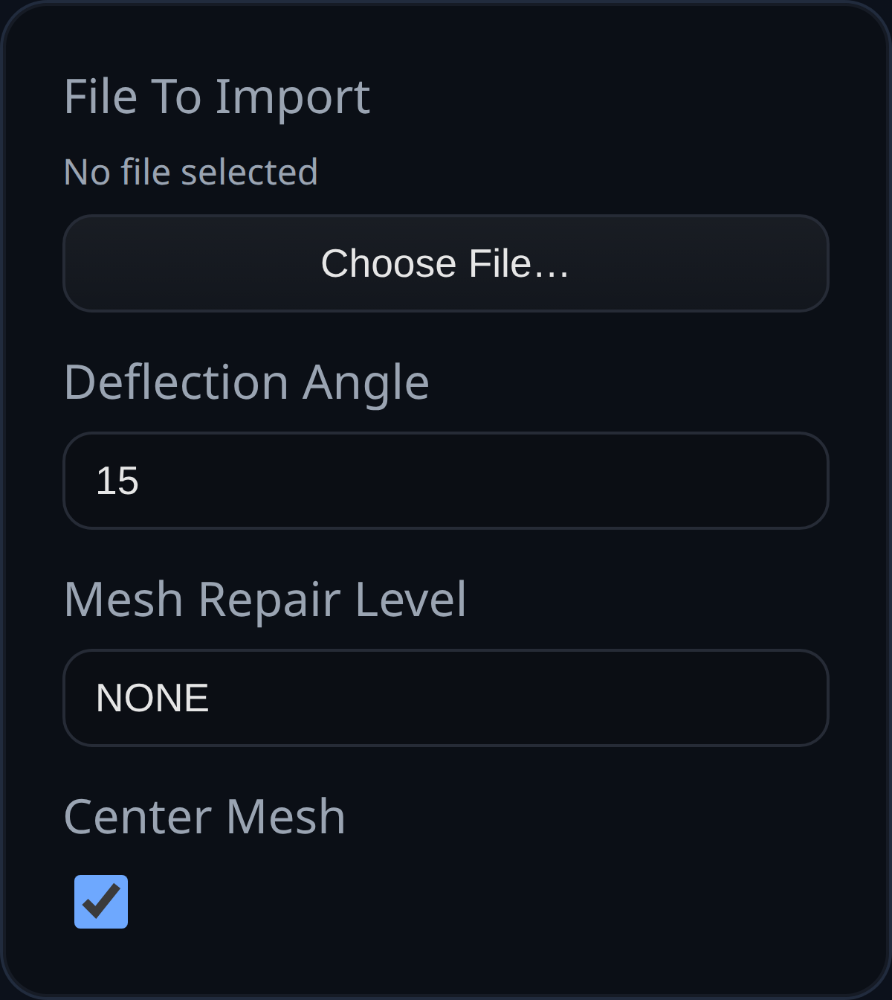

# Import 3D Model

Status: Implemented

Import 3D Model loads STL or 3MF data, optionally runs a mesh repair pass, and converts the triangles into a `BREP.MeshToBrep` solid.

## Inputs
- `fileToImport` – STL (ASCII or binary) or 3MF data supplied as a string, data URL, or ArrayBuffer.
- `deflectionAngle` – face split angle in degrees used when converting the triangle mesh into analytic faces.
- `meshRepairLevel` – `NONE`, `BASIC`, or `AGGRESSIVE` passes through `BREP.MeshRepairer`.
- `centerMesh` – translate the imported geometry so its bounding box center is at the origin before conversion.

## Behaviour
- Strings are treated as ASCII STL unless the data begins with a base64 data URL; ArrayBuffers are inspected for ZIP headers (`PK`) to decide between 3MF and binary STL.
- When a 3MF file is provided, all meshes in the archive are transformed into world space and merged into a single BufferGeometry before conversion.
- No timeline or feature history is recovered from the source file—the importer always produces a single solid representing the mesh.
