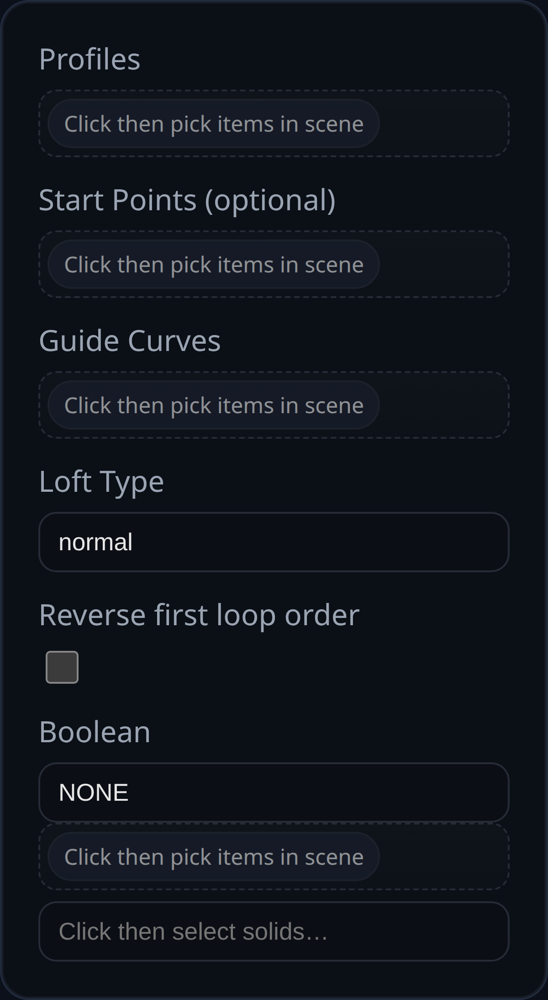

# Loft

Status: Implemented

Loft stitches two or more faces (or sketches containing faces) into a single solid by marching matching loop samples between the profiles.

## Inputs
- `profiles` – ordered list of faces or sketches. Each sketch must contain a face; the sketch is removed after use.
- `referencePoints` – optional vertex selections that provide starting indices per profile. Supply the same number of points as profiles if you need to align loop ordering manually.
- `guideCurves` – currently unused; guide curves are planned but not yet consumed by the feature.
- `loftType` – interpolation strategy (e.g., ruled vs. smooth). Current implementation accepts the field for compatibility but behaves as a standard smooth loft.
- `reverseFirstLoop` – flips the direction of the first profile’s outer loop to help match winding between sections.
- `boolean` – optional union/subtract/intersect with existing solids after the loft is generated.

## Behaviour
- The first profile drives naming for side faces. Boundary loops (outer + holes) are read from `face.userData.boundaryLoopsWorld` when available; otherwise edge polylines are sampled.
- Profiles must share topology (same number of loops and similar tessellation) for reliable results. When loops differ, the feature falls back to nearest-point mapping which may twist surfaces.
- After the loft solid is built, sketches used as inputs are flagged for removal, and the optional boolean operation runs if configured.
