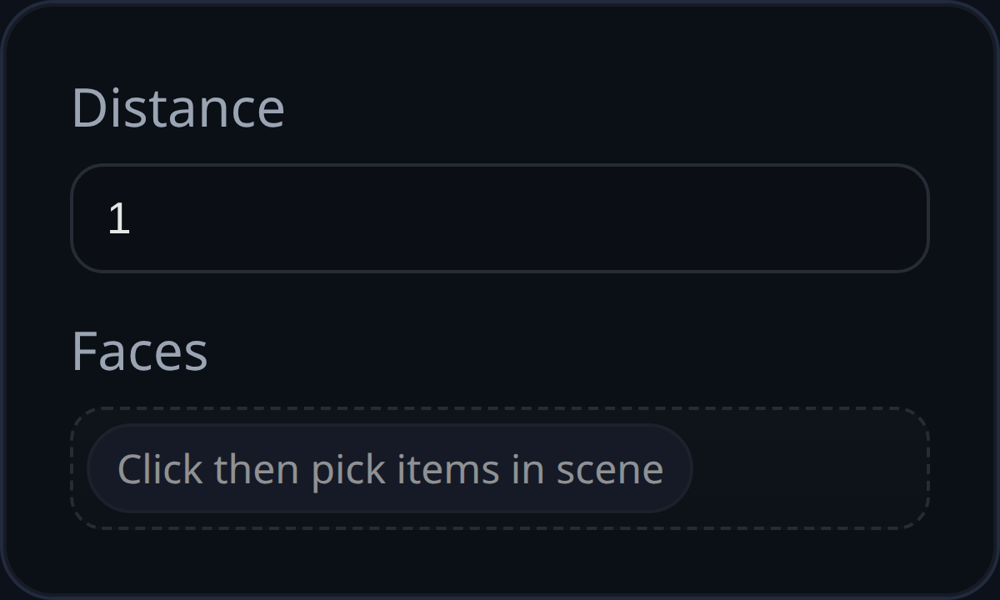

# Offset Shell

Status: Implemented

Offset Shell offsets every face of a solid outward or inward by a uniform distance, producing a new shelled solid. It requires selecting a face on the target solid only to identify which solid to process.

## Inputs
- `faces` – One or more faces on the solid to shell (used to pick the parent solid). All faces must belong to the same solid.
- `distance` – Signed offset distance. Positive grows the solid; negative shrinks it. Must be non-zero.
- `id` – Optional identifier applied to the generated shell and its faces.

## Behaviour
- Collects the solid from the selected faces; aborts if selections span multiple solids or no solid is found.
- Uses `OffsetShellSolid.generate` to build a new shell solid at the requested offset; leaves the original solid untouched.
- Names the result `<parentName>_<featureID>` and visualizes it for downstream selection.
