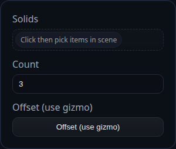

# Pattern Linear

Status: Implemented

Pattern Linear duplicates solids by translating copies along a single offset vector.

## Inputs
- `solids` – solids to duplicate. If you pick faces/edges the owning solid is inferred.
- `count` – total number of instances including the original. Values below 1 are clamped.
- `offset.position` – translation applied between instances (set via the transform gizmo). Rotation and scale fields are ignored.

## Behaviour
- The feature clones each solid and bakes a translation of `offset.position * instanceIndex` into the geometry. The source solid is untouched.
- Face IDs on the copies are remapped and tagged with the feature ID so downstream selections stay unique per instance.
