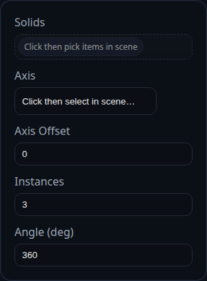

# Pattern Radial

Status: Implemented

Pattern Radial rotates copies of solids about a selected edge axis.

## Inputs
- `solids` – solids to copy. The feature pulls the owning solid when faces or edges are selected.
- `axisRef` – an edge whose direction defines the rotation axis. The feature samples the edge polyline or geometry to recover two points.
- `centerOffset` – shift the rotation center along the axis direction before copies are generated.
- `count` – total number of instances including the original.
- `totalAngleDeg` – angle in degrees spanned by all additional instances. With `count = n`, each copy is spaced at `(totalAngleDeg / n) * index`.

## Behaviour
- Copies are produced by cloning the solids, rotating them around the computed axis, and baking the transform. The original solid stays in place.
- Face IDs on each copy are rewritten with a `::FeatureID_instance` suffix to keep downstream selections distinct.
