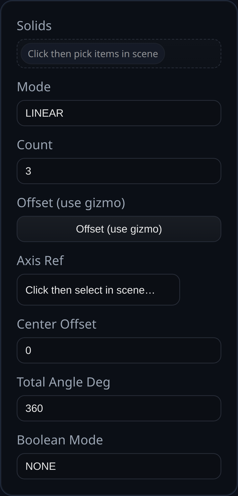

# Pattern (Legacy)

Status: Implemented

Pattern is the legacy combined pattern tool that can create either linear or circular arrays of solids, with an option to union instances back into the source.

## Inputs
- `solids` – Solids to pattern. Face/edge selections resolve their owning solid automatically.
- `mode` – `LINEAR` or `CIRCULAR`.
- `count` – Total instances including the original (clamped to ≥1).
- `offset` – Transform used for linear patterns; only `position` is applied between instances.
- `axisRef` – Face or datum plane supplying the axis and origin for circular patterns.
- `centerOffset` – Distance along the axis from the reference origin to the pattern center.
- `totalAngleDeg` – Total sweep angle distributed across circular instances.
- `booleanMode` – `NONE` returns separate bodies; `UNION` fuses clones into the source and removes the originals.

## Behaviour
- Linear mode translates clones by `offset.position * instanceIndex`; circular mode rotates clones about the referenced axis and center.
- When `booleanMode` is `UNION`, clones are merged into each source solid and the originals are flagged for removal; otherwise all clones are returned as separate solids.
- Face names on clones are retagged with the feature ID to keep downstream selections stable even when booleaned together.
