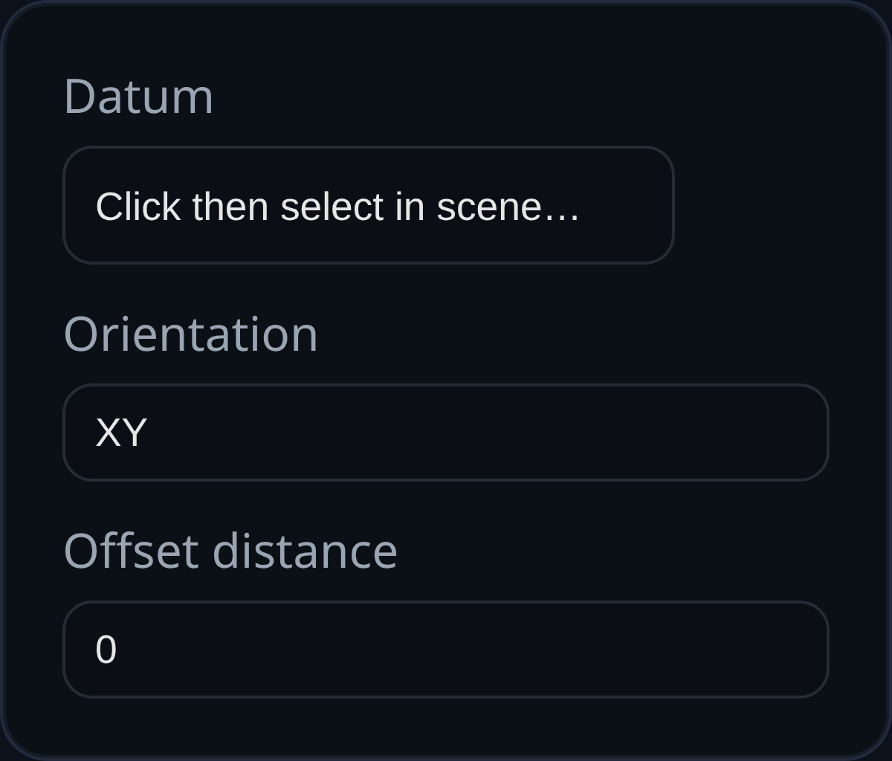

# Plane

Status: Implemented

Plane creates a square construction mesh that can be used as a sketch or measurement reference.

## Inputs
- `orientation` – choose one of the world-aligned bases (`XY`, `XZ`, `YZ`).
- `datum` – reserved for future datum-based placement (currently ignored).
- `offset_distance` – reserved; the current implementation does not shift the plane.

## Behaviour
- A 5×5 mesh is emitted with the selected orientation. The feature ID is assigned to the mesh name and UUID so other features can reference it through `PLANE` selection filters.
- Use downstream transform features if you need the plane positioned away from the origin; offsetting directly inside the feature is not yet supported.
