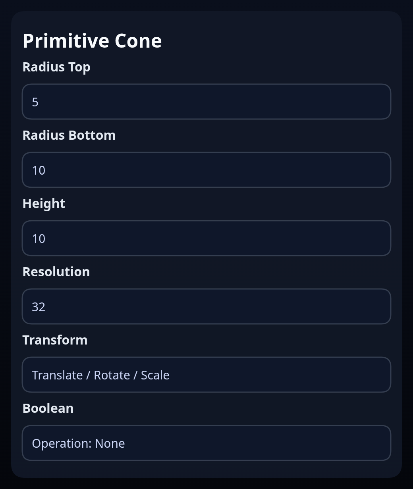

# Primitive Cone

Status: Implemented

Primitive Cone builds a frustum aligned to the +Y axis using `BREP.Cone`.

## Inputs
- `radiusTop` / `radiusBottom` – radii at the top and base. Setting the top radius to `0` creates a sharp tip.
- `height` – distance along +Y from base to tip.
- `resolution` – number of segments around the circumference.
- `transform` – optional position/orientation/scale baked into the solid.
- `boolean` – optional downstream boolean operation (union/subtract/intersect) applied immediately after creation.

## Behaviour
- A centerline is authored along the local Y axis (respecting the transform) so the cone can be reused as an axis reference.
- When a boolean operation is configured, the helper removes any consumed solids and returns only the boolean results; otherwise the raw cone solid is returned.
