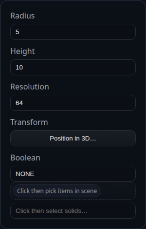

# Primitive Cylinder

Status: Implemented

Primitive Cylinder creates a right cylinder aligned to the +Y axis.

## Inputs
- `radius` – cylinder radius.
- `height` – distance along +Y.
- `resolution` – number of circular segments.
- `transform` – optional translation/rotation/scale baked into the solid.
- `boolean` – optional union/subtract/intersect applied after creation.

## Behaviour
- A centerline is recorded along the local axis so downstream constraints can re-use it.
- The base of the cylinder starts at the origin; relocate it with the transform or a later Transform feature.
