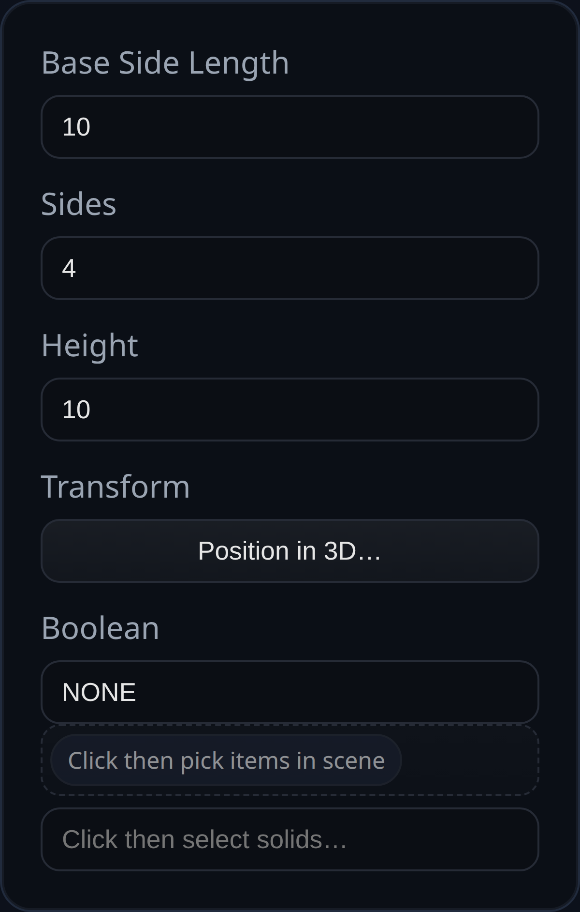

# Primitive Pyramid

Status: Implemented

Primitive Pyramid extrudes a regular polygon base to an apex aligned with the +Y axis.

## Inputs
- `baseSideLength` – length of each side on the base polygon.
- `sides` – number of sides for the base (minimum 3).
- `height` – tip-to-base distance along +Y.
- `transform` – optional translation/rotation/scale applied to the solid.
- `boolean` – optional boolean operation performed after the pyramid is generated.

## Behaviour
- The solid is centered at the origin with the apex at `+height/2` and the base at `-height/2`. Use the transform input or a downstream transform to reposition it.
