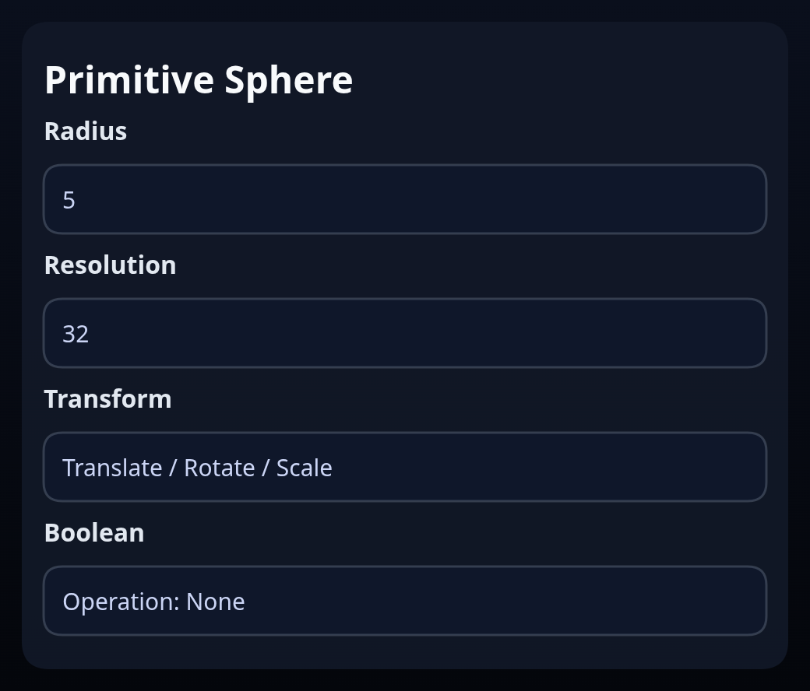

# Primitive Sphere

Status: Implemented

Primitive Sphere builds a sphere centered at the origin using `BREP.Sphere`.

## Inputs
- `radius` – sphere radius.
- `resolution` – base longitudinal segment count (latitude segments are derived).
- `transform` – optional translation/rotation/scale baked into the solid.
- `boolean` – optional boolean operation run after creating the sphere.

## Behaviour
- The feature emits a single analytic face representing the sphere. Use the transform to move it before combining with other bodies.
