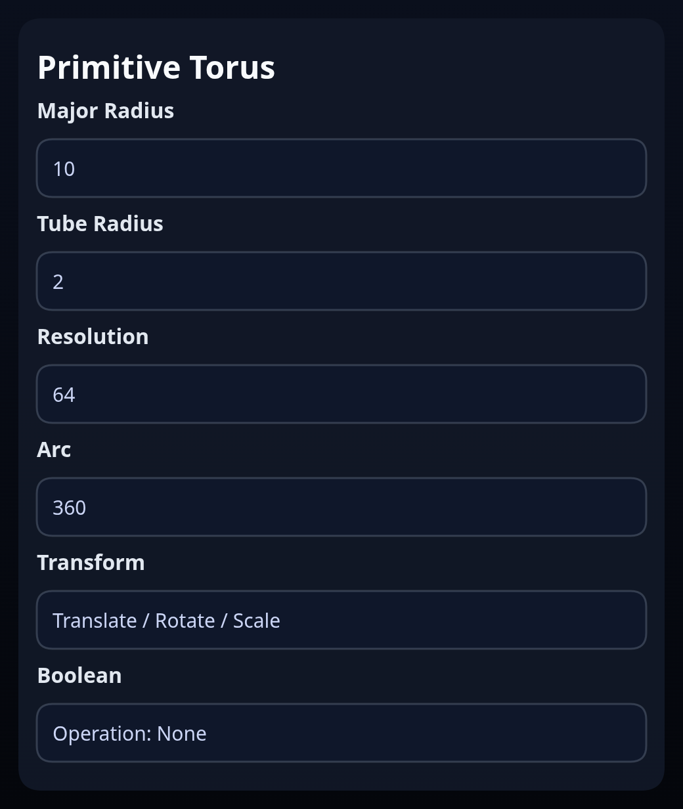

# Primitive Torus

Status: Implemented

Primitive Torus creates a torus (full or partial) around the local Y axis.

## Inputs
- `majorRadius` – distance from the center to the tube centerline.
- `tubeRadius` – radius of the tube itself.
- `resolution` – segment quality around the torus.
- `arc` – sweep angle in degrees; values below 360 produce capped ends.
- `transform` – optional translation/rotation/scale baked into the solid.
- `boolean` – optional boolean operation run after creation.

## Behaviour
- A centerline is stored along the revolve axis for reuse. With partial arcs the feature automatically builds end caps so the body stays watertight.
