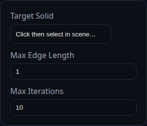

# Remesh

Status: Implemented

Remesh clones a selected solid and refines its triangulation based on a target edge length.

## Inputs
- `targetSolid` – the solid to remesh. The original is flagged for removal after the clone is generated.
- `maxEdgeLength` – splits any triangle edges longer than this value.
- `maxIterations` – number of refinement passes to run.

## Behaviour
- The feature duplicates the solid, runs `solid.remesh({ maxEdgeLength, maxIterations })`, and returns the new solid while marking the source solid for removal.
- Use upstream booleans or transforms if you need to work on multiple solids; Remesh operates on a single target at a time.
