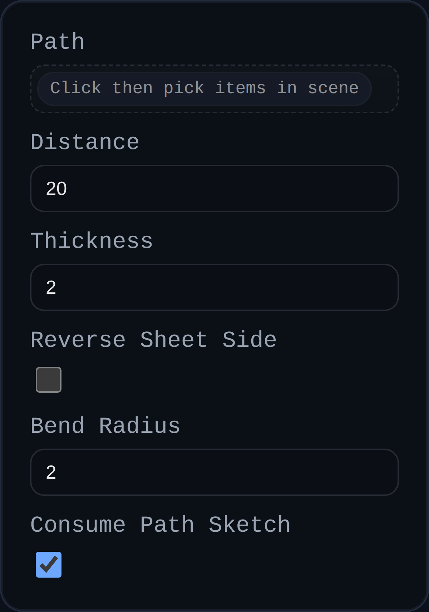

# Sheet Metal Contour Flange

Status: Implemented

Contour Flange converts an open sketch (or connected edge chain) into a sheet metal body by sweeping a rectangular strip along the curves. The tool inserts bend radii wherever adjacent segments meet so downstream features inherit accurate manufacturing parameters.

## Inputs
- `path` – Open sketch or connected edges describing the contour path. Paths are auto-sorted and filleted.
- `distance` – Width of the strip measured perpendicular to the selected path. Negative values flip the strip direction.
- `thickness` – Sheet-metal thickness, extruded normal to the sketch plane.
- `bendRadius` – Default inside bend radius used to round every sharp joint.
- `reverseSheetSide` – Flip which side of the sketch plane receives material (handy when the automatic side is opposite your intent).
- `consumePathSketch` – Optional checkbox to remove the driving sketch after the body is created (disable to keep it visible for downstream edits).

## Behaviour
- Builds a rectangular sweep profile (`distance × thickness`) anchored to the selected path, then uses `BREP.Sweep` in `pathAlign` mode so bends follow the path curvature.
- Automatically fillets the path with the supplied bend radius (so two-line sketches become manufacturable flanges without extra work).
- Removes consumed sketch groups once the flange body is generated.
- Annotates created solids with `userData.sheetMetal` metadata (base type, thickness, bend radius, sheet side, etc.) for downstream flange/cutout operations.
