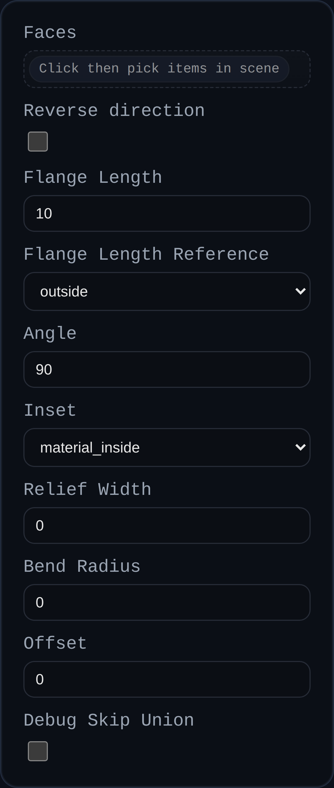

# Sheet Metal Flange

Status: Implemented

Sheet Metal Flange bends one or more thin side faces away from an existing sheet metal body. It reuses the base face and hinge edge to revolve a bend, offsets it to match typical inside/outside measurements, and can optionally extend a straight leg past the bend.

## Inputs
- `faces` – Thin side faces that define the bend profile. The feature reads sheet-metal metadata on these faces/solids to recover thickness and default bend radius.
- `angle` – Bend angle relative to the parent sheet (clamped 0–180°; 90° is perpendicular).
- `useOppositeCenterline` – Reverse which sheet-metal edge (A vs B) is used for the hinge if the default folds the wrong way.
- `flangeLength` – Optional straight leg length extruded from the bend end face. Set to `0` to create only the bend.
- `flangeLengthReference` – Measurement basis for the straight leg: `inside`, `outside`, or `web` (no adjustment). Inside/outside references subtract bend radius and/or thickness to align with common flange callouts.
- `inset` – Positions the bend centerline relative to the source face: `material_inside`, `material_outside` (default), or `bend_outside`. Each preset offsets by the bend radius/thickness before building the bend.
- `offset` – Additional manual inset/outset distance applied along the face normal. Negative values cut a matching pocket from the parent sheet; positive values shift the bend outward.
- `bendRadius` – Optional override for the bend radius. Defaults to the parent sheet’s stored radius or the inferred thickness when metadata is missing.
- `reliefWidth` – Extra clearance added to negative offsets when trimming into the parent sheet to avoid coplanar artifacts.
- `debugSkipUnion` – Return raw bend/offset solids without uniting them back into the parent (for debugging).

## Behaviour
- Derives sheet thickness and default bend radius from the selected face/solid metadata (`sheetMetalThickness` / `sheetMetalBendRadius`), falling back to thickness `1` when absent.
- For each face, picks a hinge line (favoring faces tagged `A`/`B`) and revolves the face by the requested angle. A second pass retunes the hinge offset if the measured bend radius drifts from the target.
- Applies inset/outset and manual offsets before creating the bend; negative offsets subtract a spacer from the parent sheet when possible, while positive offsets translate the flange outward.
- When `flangeLength` is non-zero, extrudes a flat leg from the bend end cap, honoring the selected length reference and any offset translation.
- Attempts to union every generated flange back into its parent solid, but falls back to returning separate solids if the boolean fails or union is disabled.
- Tags outputs with `userData.sheetMetal` (`baseType: FLANGE`, thickness, bend radius, angle, inset mode, offsets, etc.) and mirrors the values into the `MetadataManager` for downstream sheet-metal operations.
