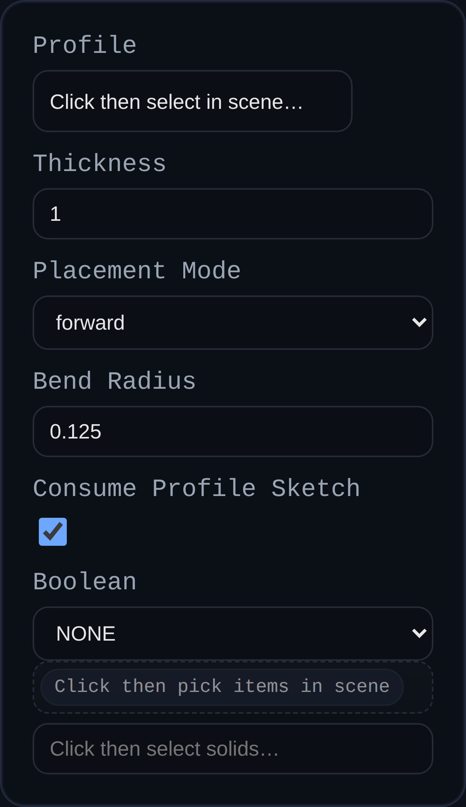

# Sheet Metal Tab

Status: Implemented

The Sheet Metal Tab feature creates a base flange by extruding a closed sketch (or face) by a specified thickness. Besides generating geometry via the robust sweep implementation, it records the sheet thickness so downstream flange/cutout tools can reuse the value.

## Inputs
- `profile` – Closed sketch or face defining the tab footprint. If a sketch is selected it will be removed from the scene once the tab body is generated.
- `thickness` – Sheet metal thickness. The feature uses this value for both the physical extrusion distance and the stored sheet metadata.
- `placementMode` – Determines how the thickness is applied relative to the sketch plane: forward, reverse, or midplane (symmetric).
- `bendRadius` – Captured default bend radius for the part. The geometry ignores this value (tabs are planar) but downstream flange/cutout features reuse it.
- `consumeProfileSketch` – Checkbox to remove the driving sketch after the tab is created. Disable to leave the sketch visible for edits or reuse.
- `boolean.operation` / `boolean.targets` – Optional union/subtract/intersect with existing solids.

## Behaviour
- Tabs reuse the `BREP.Sweep` translator to form solids and automatically remove consumed sketches unless `consumeProfileSketch` is turned off.
- Every resulting solid receives `userData.sheetMetal` metadata (`baseType: TAB`, `thickness`, `bendRadius`, `consumeProfileSketch`, etc.) plus mirrored entries in the `MetadataManager`.
- Thickness must be greater than zero; negative inputs flip the placement automatically unless an explicit mode is chosen.
