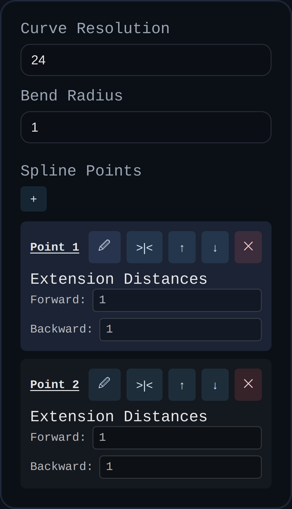

# Spline

Status: Implemented

Spline creates a Hermite-style spline curve using an interactive point list widget. The curve is stored as editable spline data and rendered at a configurable resolution.

## Inputs
- `curveResolution` – Samples per segment used to draw the spline preview.
- `bendRadius` – Controls smoothness between points; smaller values sharpen bends.
- `splinePoints` – Editable point list (via the embedded widget) that defines spline anchors and tangents.

## Behaviour
- Opens an interactive spline editor inside the dialog to add/reorder/drag control points and tangents.
- Stores normalized spline data in `persistentData.spline` so reruns reuse the edited curve.
- Re-renders the spline preview at the requested resolution whenever points or bend radius change.
