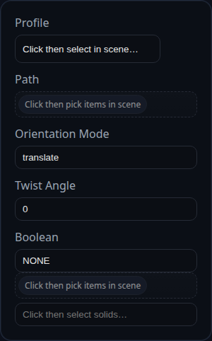

# Sweep

Status: Implemented

Sweep extrudes a single profile along one or more connected path edges using `BREP.Sweep`.

## Inputs
- `profile` – a face or sketch containing a face. Sketch parents are removed once the sweep succeeds.
- `path` – one or more edges that define the sweep trajectory. Edges are chained in the order selected.
- `orientationMode` – `translate` keeps the profile orientation fixed; `pathAlign` attempts to align the profile frame to the path.
- `twistAngle` – reserved for future use; the current implementation ignores this value.
- `boolean` – optional union/subtract/intersect applied after the sweep solid is built.

## Behaviour
- The feature requires a path selection; without it the sweep throws an error to prompt the user.
- Helper solids remove the input sketch (if any) and run the configured boolean operation, returning only the resulting solids.
