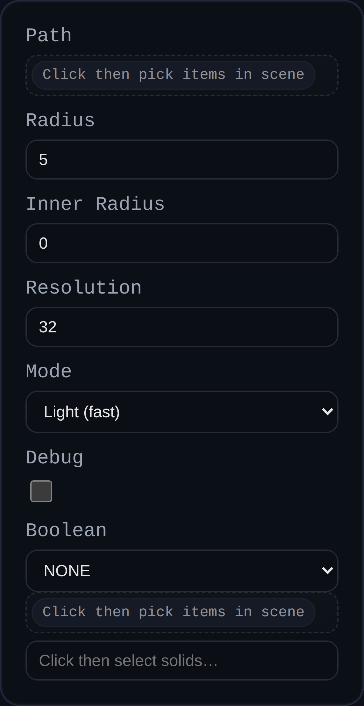

# Tube Feature

The Tube feature now builds a sequence of convex hulls between overlapping spheres placed on the path points. Those hulls are united into the final body (with optional hollowing), so even very tight corners stay self-intersection free while keeping a consistent radius.

## Inputs

- **Path** – Select one or more connected `EDGE` entities. The feature orders the edges into a single polyline; branches are ignored. Sketch edges, face edges, or imported curve edges can all be used.
- **Radius** – Outer radius of the tube. Must be positive.
- **Inside Radius** – Optional hollow core. Set to `0` (default) for a solid tube. Any positive value smaller than the outer radius produces a hollow tube with open ends and wall thickness `radius - insideRadius`.
- **Resolution** – Number of segments around the tube. Higher values yield smoother cylinders at the cost of more triangles.
- **Boolean** – Optional boolean operation against existing solids.

## Notes

- Path edges are evaluated in world space, so you can mix sketch geometry with edges from previous features.
- When multiple edges are selected, the feature automatically chains them end-to-end. Use construction geometry or split edges if you need explicit control over path ordering.
- Hollow tubes generate inner and outer walls plus ring faces at the ends, keeping the part watertight.
- Open tubes are trimmed with planes perpendicular to the first and last segments, giving clean ring ends while retaining the rounded outer body.

## Typical Workflow

1. Create a sketch with the desired centerline, or select edges from existing geometry.
2. Add a Tube feature, select the path edges, and set the outer radius.
3. Optionally set an inside radius to make the tube hollow and adjust the resolution for smoother roundness.
4. Apply boolean operations (Add/Subtract/Intersect) if you need the tube to merge with other solids.

This feature is ideal for modelling piping runs, wiring conduits, curved handrails, and other cylindrical geometry that has to follow arbitrary paths.
