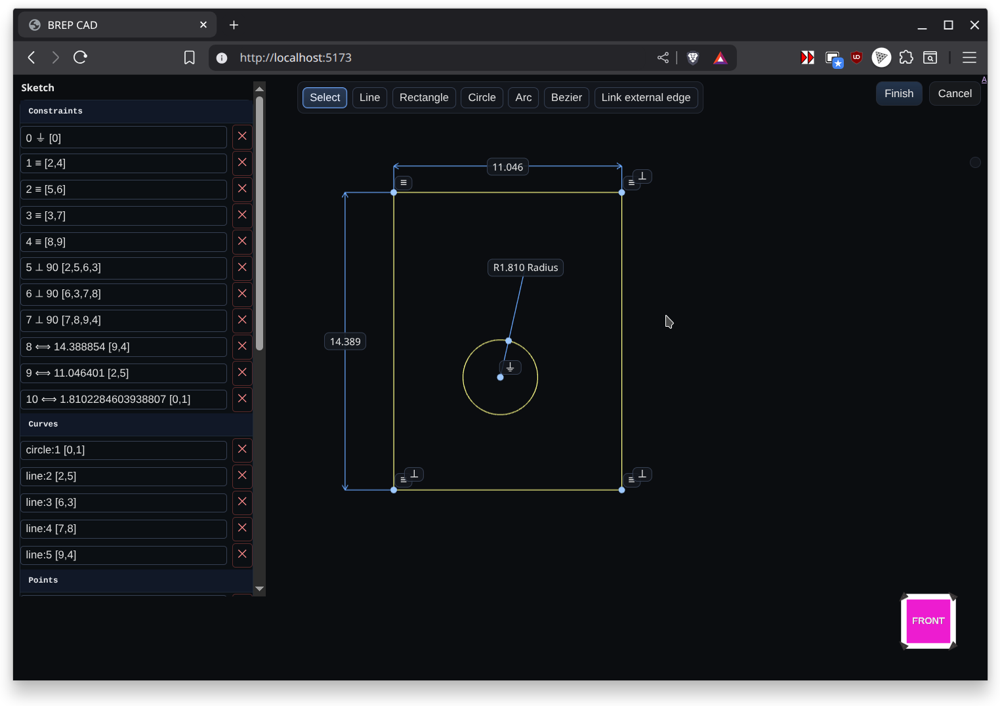

# Sketch Mode

Sketch Mode opens the 2D sketcher on a selected plane or face. Use it to draft profiles that become the basis for Extrude, Revolve, Loft, or Sweep features. Geometry is constrained within a local coordinate system, letting you dimension lines, arcs, and splines precisely.

Workflow highlights:
- Choose a plane or datum, then activate Sketch Mode from the feature history
- Draw with line, rectangle, circle, arc, spline, and text tools
- Apply constraints and dimensions to lock intent before returning to Modeling Mode

When you finish, the sketch remains parametric and updates downstream features as you edit it later.
