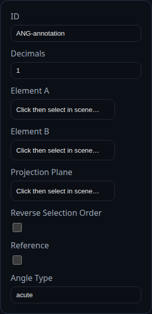

# Angle Dimension

Status: Implemented

Angle dimensions measure the sweep between two faces or edges and display the result on the active PMI sheet. Use them for chamfers, draft checks, and assembly alignment callouts.

## Inputs
- `annotationID` – optional identifier retained in PMI exports.
- `decimals` – decimal precision; defaults to the PMI `angleDecimals` preference.
- `elementARefName` / `elementBRefName` – face or edge selections that define the angle.
- `planeRefName` – optional face or datum to override the projection plane.
- `reverseElementOrder` – flips the measured side when the automatic choice is not desired.
- `angleType` – choose `acute`, `obtuse`, or `reflex` sweep to control value formatting.
- `isReference` – encloses the output in parentheses and signals downstream reference handling.

## Behaviour
- Derives edge or face directions, constructs a local 2D basis, and draws an arc with adjustable radius.
- Arrowheads, witness lines, and arc radius scale in screen space to remain readable while zooming.
- Labels can be dragged; the world-space location is persisted and reused on reload.
- Responds to PMI formatting callbacks so custom units or tolerancing schemes propagate to the label text.

## Usage Tips
- Provide a projection plane when measuring between non-parallel faces to control which cross-section drives the angle.
- Toggle `reverseElementOrder` if the drawn arc lands on the wrong side of the intersection.
- Use the `reflex` option to call out angles greater than 180° without recomputing geometry.
