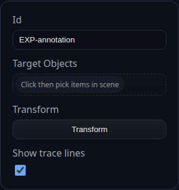

# Explode Body (View Transform)

Status: Implemented

Explode Body annotations reposition solids inside a PMI view without touching the master model. They are ideal for exploded assemblies, service manuals, and view-specific storyboards.

## Inputs
- `annotationID` – optional persistent identifier.
- `targets` – one or more solid selections that will be repositioned.
- `transform` – translation and rotation applied to the selected solids; edited through the PMI transform gizmo.
- `showTraceLine` – toggles dashed trace lines from the original location to the displaced position.

## Behaviour
- Captures the original placement for every targeted solid and reapplies it automatically when you leave PMI mode.
- Composes successive edits so you can tweak the displacement without accumulating transform drift.
- Draws trace lines that update live as you drag the gizmo, helping viewers understand the exploded direction.
- Shares infrastructure with other PMI annotations, so undo/redo, history, and persistence all work consistently.

## Usage Tips
- Create separate Explode Body annotations per PMI view to stage unique assembly moments without impacting the base model.
- Toggle trace lines off for clean presentation shots or on to emphasize motion.
- Pair with leader or note annotations to explain the purpose of each displaced component.
