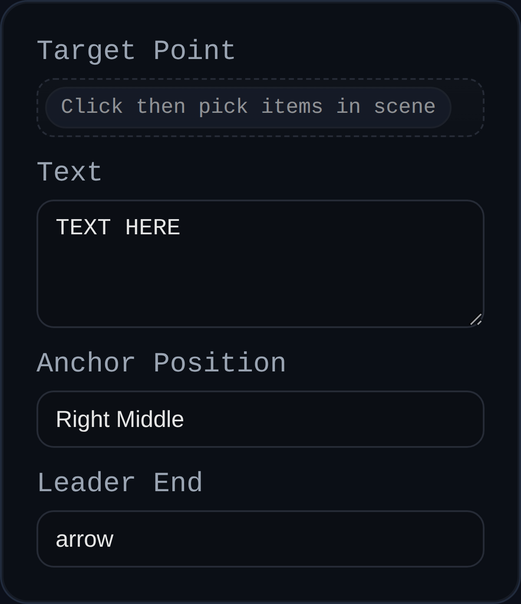

# Leader

Status: Implemented

Leader annotations attach custom text to one or more points, providing flexible callouts for notes, GD&T, or assembly instructions inside PMI mode.

## Inputs
- `annotationID` – optional identifier for downstream consumption.
- `target` – one or more vertex selections to anchor the leader.
- `text` – multiline body shown in the label; defaults to the PMI `leaderText` preference when provided.
- `anchorPosition` – preferred label alignment (Left/Right × Top/Middle/Bottom).
- `endStyle` – choose an `arrow` head or `dot` terminator for the leader tail.

## Behaviour
- Resolves the selected vertices, averages them, and builds approach lines that fan out vertically to avoid overlap.
- Shoulder length and arrow size scale with screen space for consistent visual weight.
- Labels are persisted in world space so your layout survives mode switches and document reloads.
- Text passes through PMI formatting hooks, enabling automatic reference tags or unit decorations.

## Usage Tips
- Use multiple targets to annotate bolt groups or pattern features with a single note.
- Switch the anchor position when the label overlaps other callouts; PMI reflows the leader shoulder automatically.
- Toggle to `dot` end style when calling out surface areas or datum points that do not require arrowheads.
