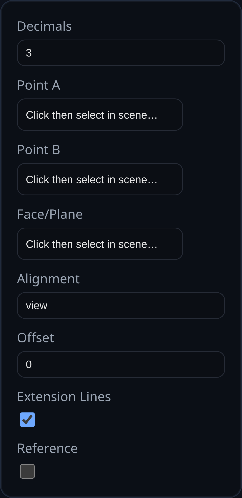

# Linear Dimension

Status: Implemented

Linear dimensions measure the distance between two vertices and project the result into the active PMI view. Use them to document edge-to-edge spacing and critical offsets without altering model geometry.

## Inputs
- `annotationID` – optional identifier stored with the PMI payload.
- `decimals` – decimal precision; defaults to the PMI mode `dimDecimals` preference.
- `aRefName` / `bRefName` – vertex references that define the measured span.
- `planeRefName` – optional face or datum plane that controls projection.
- `alignment` – lock the dimension to the view plane or one of the global axes (XY, YZ, ZX).
- `offset` – distance to shift the dimension line away from the measured span; dragged labels update this value automatically.
- `showExt` – toggle extension lines from anchors to the offset dimension line.
- `isReference` – wraps the display text in parentheses when set.

## Behaviour
- Distance is recomputed whenever anchor geometry updates; labels stay associative.
- Arrowheads and extension lines scale with screen distance so dimensions remain legible at any zoom.
- Labels can be dragged; the system captures the world position and extension offset for repeatable layouts.
- Dimensions respect PMI inspector formatting hooks such as `formatReferenceLabel` for dual-units or reference styling.

## Usage Tips
- Pick a projection plane when the default view alignment produces ambiguous results (e.g., angled faces).
- Use `alignment = view` with the PMI triad to quickly dimension sketch-like layouts, or axis alignment to match drawing standards.
- Combine with reference dimensions to communicate non-driving measurements without cluttering the model.
