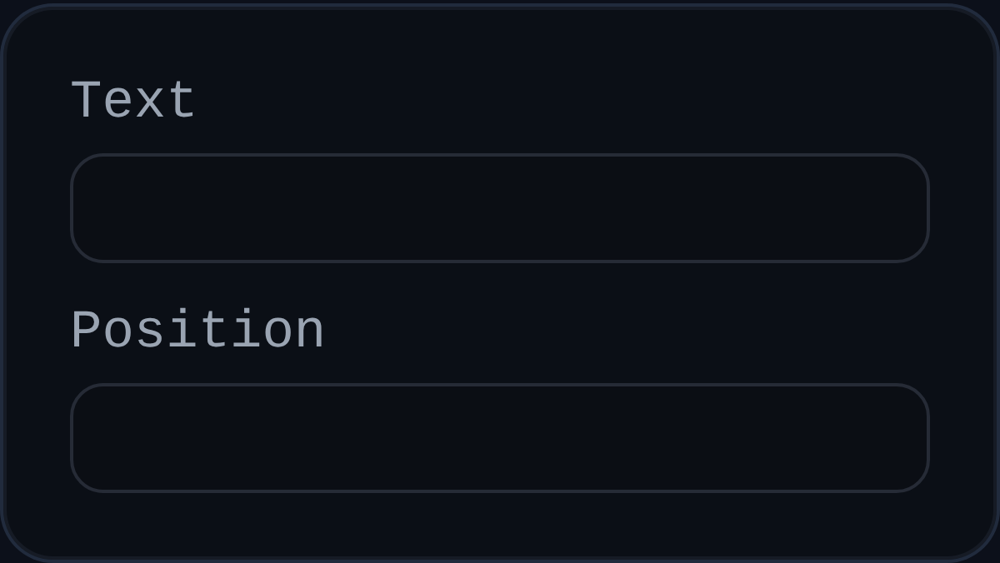

# Note

Status: Implemented

Note annotations drop standalone text markers into a PMI view for general instructions, inspection checkpoints, or revision flags.

## Inputs
- `annotationID` – optional persistent identifier.
- `text` – single-line message; defaults to the PMI `noteText` preference.
- `position` – world-space coordinates of the note marker.

## Behaviour
- Renders a screen-space dot at the saved position and displays the note text as a floating label.
- Automatically offsets the label from the view normal so it remains legible; dragging the label stores a new world position.
- Plays nicely with PMI label formatting utilities, enabling consistent text styling across annotations.

## Usage Tips
- Use notes for freeform callouts that do not require geometry selection.
- Combine with leader annotations when you need both a persistent marker and directional leader text.
- Adjust the label placement by dragging once it appears to avoid overlapping other PMI elements.
