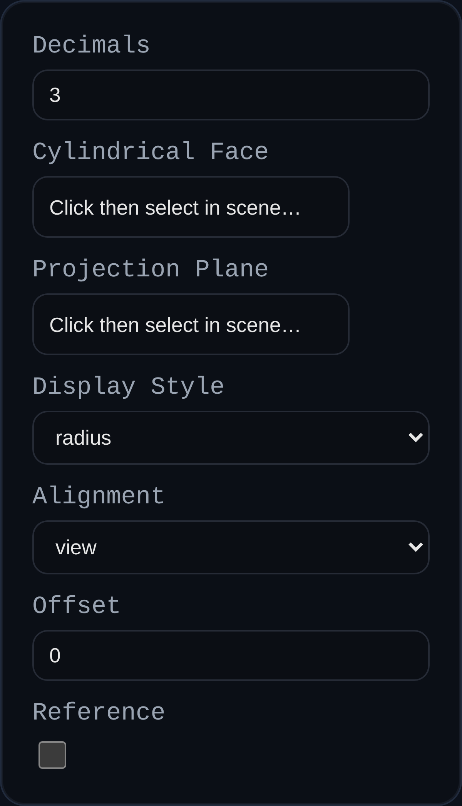

# Radial Dimension

Status: Implemented

Radial dimensions expose radii or diameters of cylindrical faces directly in PMI views. They support associative updates to revolved geometry, holes, and rounds.

## Inputs
- `annotationID` – optional persistent identifier.
- `decimals` – numeric precision; inherits the PMI mode `dimDecimals` setting when left blank.
- `cylindricalFaceRef` – cylindrical face reference used to extract the centerline and radius.
- `planeRef` – optional face or datum that defines the projection plane.
- `displayStyle` – choose `radius` or `diameter` output.
- `alignment` – align leader projection to the current view or a principal axis.
- `offset` – shifts the label outward from the cylindrical surface; dragging the label updates the stored offset.
- `isReference` – formats the value as a reference dimension.

## Behaviour
- Automatically computes center point, radial vector, and arrow geometry for both radius and diameter callouts.
- Maintains associative links to the source cylinder; machining edits update the PMI value on regen.
- Supports interactive label dragging on the projection plane while preserving trace lines and offsets.
- Center markers and arrows scale with screen space to stay readable while orbiting.

## Usage Tips
- Supply a projection plane when the default view produces misleading offsets, especially for angled holes.
- Use diameter display style (`Ø`) for holes and radius display (`R`) for fillets to match common drawing conventions.
- Pair with linear dimensions to fully define hole patterns and bolt circles in a single PMI view.
